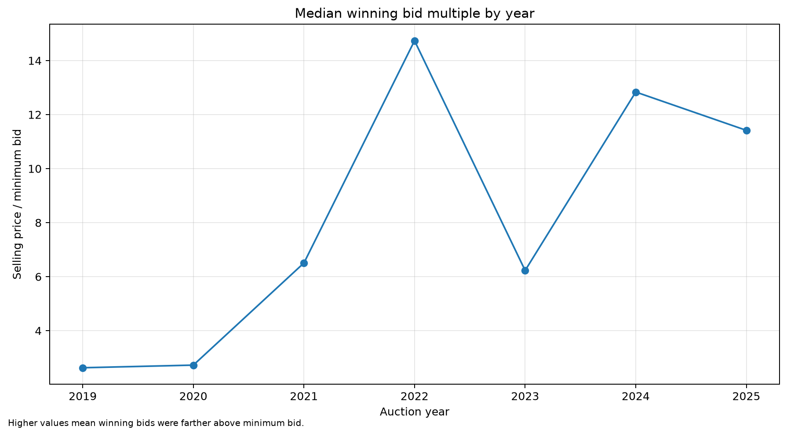
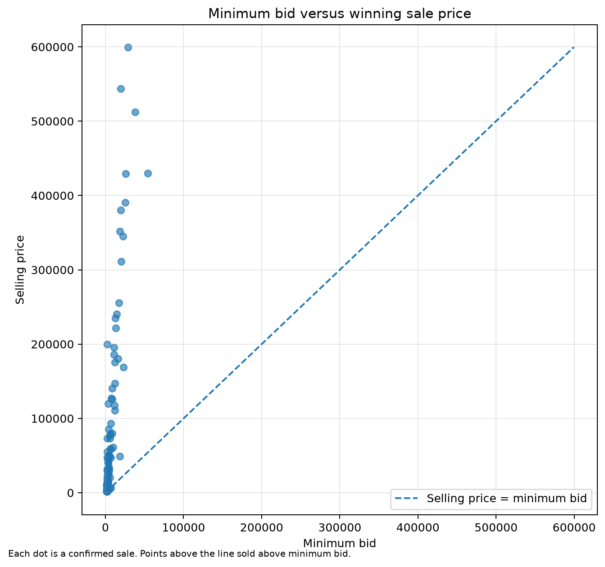
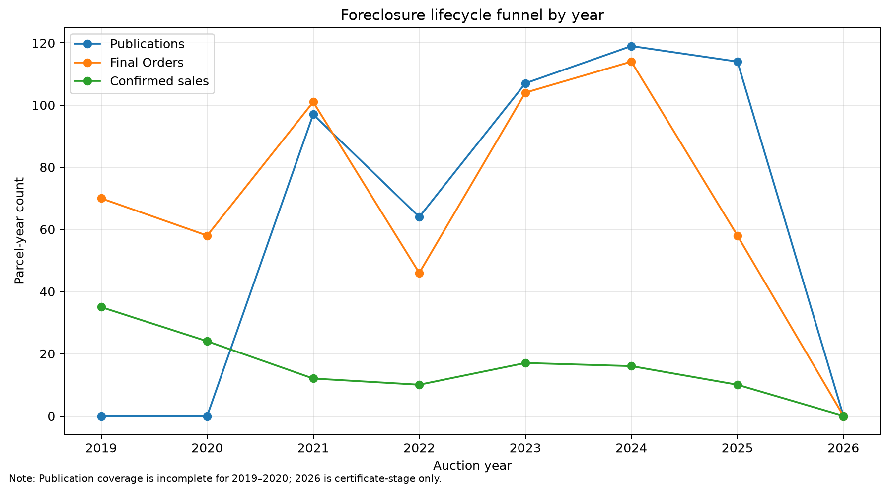
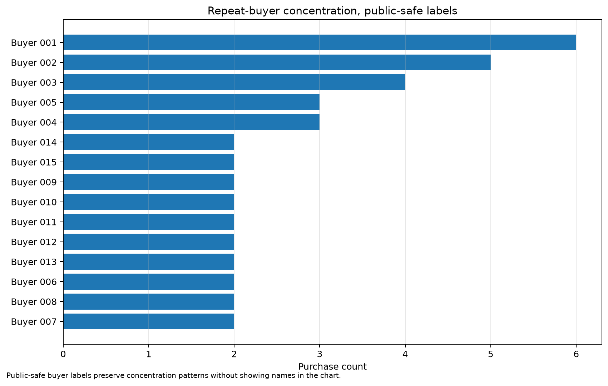
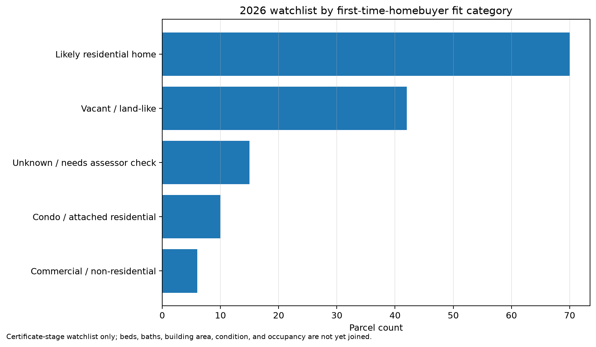

# Snohomish County Tax Foreclosure Auction Analyzer

A reproducible data project that connects Snohomish County tax foreclosure records into a parcel-level lifecycle dataset.

The project follows parcels through the tax foreclosure process:

```text
Certificate of Delinquency
→ Affidavit of Publication
→ Final Order of Sale
→ Return of Sale
→ Excess Funds, where available
```

The goal is to make public tax foreclosure records easier to analyze for research, education, and practical due diligence.

---

## Why this project exists

Tax foreclosure auction records are public, but they are spread across separate PDFs, court documents, publication notices, sale returns, and excess-funds lists. That makes it hard to answer basic questions:

- How many parcels actually reach auction?
- How often do parcels disappear before sale?
- How competitive are winning bids compared with minimum bids?
- Are auctions mostly one-off buyers or repeat participants?
- Which current-year parcels might be worth deeper due diligence?

This project builds a structured dataset and analysis pipeline so those questions can be explored consistently.

---

## Key findings so far

### Minimum bid is not a realistic purchase-price estimate

Confirmed sales show that winning bids often exceed minimum bids by several multiples. Minimum bid should be treated as the legal starting point, not a likely purchase price.

### Many parcels do not make it all the way to sale

Parcels can appear in earlier foreclosure stages and later disappear because of payment, redemption, administrative removal, or other status changes. This matters for buyers because early-stage research can be wasted if a parcel never reaches sale.

### Repeat buyers appear across multiple auction years

The Return of Sale records show both one-time buyers and repeat participants. This suggests that Snohomish tax foreclosure auctions attract a mix of occasional buyers and more specialized/professional participants.

The project includes both named and public-safe repeat-buyer outputs so the public report can remove names later if desired.

### 2026 watchlist is a screening tool, not a recommendation list

The 2026 watchlist uses Certificate-stage records to flag parcels that may warrant follow-up from a flexible first-time-homebuyer perspective.

Lens used for the current watchlist:

- ideal target: 2–3 bedrooms / 2 bathrooms;
- house preferred;
- condos and townhomes also interesting;
- rural or less conventional locations are not automatically excluded;
- vacant land, commercial/non-residential properties, and unusually low assessed values are heavily caveated.

The current watchlist does **not** yet include assessor attributes such as beds, baths, building square feet, year built, condition, HOA status, parcel geometry, or occupancy.

---

## What this analysis suggests

This project is not just a document extraction exercise. The linked lifecycle table makes it possible to analyze the tax foreclosure process as a funnel, rather than as isolated PDFs.

### 1. Minimum bid behaves more like a legal threshold than a market signal

The auction competitiveness outputs show that winning bids often exceed the minimum bid by several multiples. For buyers, this means the minimum bid is a poor affordability proxy. For analysts, it suggests that minimum bid should be modeled as an opening constraint rather than an estimate of expected sale price.





### 2. The main buyer problem is triage, not just finding parcels

The lifecycle data shows that many parcels appear before the sale stage but do not ultimately become confirmed sales. A practical buyer does not only need a list of parcels; they need a way to prioritize which parcels are still active, which ones are likely residential, and which ones have enough property information to justify deeper due diligence.



### 3. The market appears to include specialized participants

Repeat-buyer outputs show that a subset of purchasers appear across multiple auction years. This matters because first-time or occasional buyers are not only evaluating properties; they may also be competing against participants who understand the auction process, title risks, redemption dynamics, and local parcel quirks.



### 4. 2026 opportunities need assessor enrichment before true ranking

The 2026 watchlist is useful for screening, but not yet sufficient for purchase decisions. The next professional-grade improvement is to join assessor and GIS fields: beds, baths, building square feet, year built, property class, parcel geometry, hazard overlays, zoning, access, and utilities/septic indicators.



---

## Practical professional takeaways

- A low minimum bid should trigger due diligence, not excitement.
- The most valuable workflow is stage-based triage: certificate → publication → final order → sale.
- OCR imperfections are manageable if they are exposed with review flags instead of hidden.
- Public-safe repeat-buyer outputs let the project discuss market structure without relying on named individuals in the narrative.
- Assessor/GIS enrichment is the highest-value next data layer because it turns a foreclosure dataset into a property-screening dataset.

---

## Data coverage

| Source layer | Current coverage | Status |
|---|---:|---|
| Return of Sale / auction sales | 2019–2025 | Strong |
| Final Order of Sale | 2019–2025 | Usable with OCR caveats |
| Affidavit of Publication | 2021–2025; 2020 pending | Usable with caveats |
| Certificate of Delinquency | Partial; strongest for machine-readable 2024 and 2026 records | Partial / future work |
| Excess funds | Exact matches currently loaded for 2024–2025 | Partial / future work |
| Assessor / parcel characteristics | Not yet integrated | Future version |
| GIS / hazard / zoning overlays | Not yet integrated | Future version |

The project intentionally preserves coverage gaps and review flags instead of hiding them.

---

## Main outputs

Generated files are written to:

```text
outputs/public
```

Important outputs:

| Output | Purpose |
|---|---|
| `unified_parcel_lifecycle.csv` | Main parcel-year lifecycle table |
| `foreclosure_stage_events.csv` | Long-form stage/source event table |
| `unified_lifecycle_summary.csv` | Annual lifecycle summary |
| `snohomish_analysis_outputs.xlsx` | Analysis workbook |
| `analysis_annual_funnel.csv` | Annual stage funnel |
| `analysis_auction_competitiveness_by_year.csv` | Minimum bid vs sale price metrics |
| `analysis_repeat_buyer_summary.csv` | Repeat-buyer activity |
| `analysis_repeat_buyer_summary_public_safe.csv` | Repeat-buyer summary with names removed |
| `analysis_2026_homebuyer_watchlist.csv` | Early 2026 first-time-homebuyer screening table |
| `snohomish_2026_watchlist_and_public_safe_outputs.xlsx` | 2026 watchlist workbook and public-safe buyer workbook |
| `source_coverage_audit.csv` | Source coverage and caveat summary |

---

## 2026 watchlist

The 2026 watchlist is available at:

```text
outputs/public/analysis_2026_homebuyer_watchlist.csv
outputs/public/snohomish_2026_watchlist_and_public_safe_outputs.xlsx
```

The watchlist is intentionally conservative. It is designed to answer:

> Which certificate-stage parcels might be worth looking up next in the Assessor or SCOPI system?

It does **not** yet answer:

> Which parcels should someone buy?

The next step for practical use is to enrich the watchlist with assessor and GIS data.

---

## Repository structure

```text
data/
  raw/              # Public source PDFs, not committed
  private/          # OCR cache and private working files, not committed

docs/
  assets/           # Report charts
  report_draft.md
  data_coverage_and_future_work.md
  analysis_outputs_notes.md
  2026_watchlist_and_public_safe_buyers.md

outputs/
  public/           # Generated public CSV/XLSX/JSON outputs
  private/          # Private outputs, not committed

src/
  analysis/         # Analysis and report-output scripts
  data/             # Structured seed data transcribed from public records
  extract/          # PDF/OCR extraction scripts
  inventory/        # Source inventory scripts
  transform/        # Unified lifecycle builders
```

---

## Reproduce the pipeline

From the repository root:

```powershell
python -m src.inventory.build_source_inventory
python -m src.extract.parse_machine_readable_stage_records
python -m src.extract.ocr_scanned_final_orders
python -m src.extract.ocr_scanned_affidavits
python -m src.transform.build_unified_lifecycle
python -m src.analysis.build_coverage_audit
python -m src.analysis.build_analysis_outputs
python -m src.analysis.build_2026_watchlist
python -m src.analysis.build_report_graphs
```

The OCR scripts require Tesseract OCR.

---

## Current caveats

### OCR caveats

Some public records are scanned PDFs with difficult layouts. OCR can miss records, merge records, misread parcel numbers, or fail to capture owner/legal text. The project preserves review flags rather than silently treating every OCR row as perfect.

### 2020 Affidavit gap

The 2020 Affidavit of Publication did not produce usable records in the first OCR pass. It is marked as a future layout-review task rather than blocking the rest of the analysis.

### Certificate-stage coverage is partial

Certificate of Delinquency coverage is not yet complete across all years. Certificate-to-publication rates should not yet be presented as complete historical rates.

### Property characteristics are incomplete

The current lifecycle dataset has some property-use and assessed-value fields from foreclosure documents, but it does not yet include a full assessor join. Conclusions about bedrooms, bathrooms, livability, and exact homebuyer fit require future assessor enrichment.

---

## Future work

Highest-value future improvements:

- join Snohomish County assessor attributes;
- add beds, baths, building square feet, year built, property class, and gross acres;
- add parcel geometry or latitude/longitude;
- add zoning, UGA/incorporated-area, and future-land-use fields;
- add hazard overlays such as floodplain, wetlands, stream buffers, shoreline jurisdiction, steep slopes, and landslide risk;
- improve scanned Certificate of Delinquency coverage;
- manually review OCR-flagged rows and repaired parcel numbers;
- convert the report draft into a polished public article.

---

## Public-use note

Buyer and property-owner names in this dataset were transcribed from publicly available Snohomish County tax-foreclosure records. This dataset is provided for historical research, public-interest analysis, education, and reproducibility. It is not intended to be used as a marketing, solicitation, lead-generation, or contact list. Users are responsible for complying with RCW 42.56.070(8) and any other applicable law.

---

## License

MIT License.
